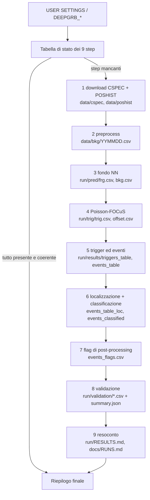

# DeepGRB — panoramica del progetto

Guida completa alla versione consolidata di DeepGRB:

- **come funziona la pipeline**, passo per passo, con ingressi, uscite, algoritmi e parametri;
- **com'è organizzato il progetto**: tree di cartelle, file di codice, documenti, dati;
- **quali file e immagini vengono generati**, da chi e dove finiscono.

Riferimenti rapidi:

- uso: `README.md` (inglese);
- risultati della baseline 2019: `docs/BASELINE_2019.md` e `docs/RUNS.md`;
- storia del lavoro: `docs/WORKLOG.md` e `docs/REFACTOR_REPORT.md`;
- regole operative: `docs/WORKING_RULES.md`.

---

## 1. In una frase

Una rete neurale stima, per ogni intervallo di 4.096 s, i conteggi di fondo che i 12 rivelatori NaI di Fermi/GBM dovrebbero vedere data la posizione e l'assetto del satellite. Poisson-FOCuS cerca gli eccessi significativi dei conteggi osservati rispetto a quel fondo. Gli eccessi diventano eventi, che vengono localizzati, classificati, segnalati con flag di qualità e confrontati con il catalogo ufficiale GBM e con le tabelle di Crupi et al. (2023).

---

## 2. La pipeline

### 2.1 Entry point e impostazioni

Un solo comando, dalla radice del repo:

```bash
python -u pipeline/pipeline_bkg.py [--jobs 4] [--dry-run]
```

In cima a `pipeline/pipeline_bkg.py` c'è il blocco **USER SETTINGS**:

| impostazione | significato | variabile d'ambiente (ha priorità) |
|---|---|---|
| `START_DATE`, `END_DATE` | periodo, giorni UTC inclusi | `DEEPGRB_START_DATE`, `DEEPGRB_END_DATE` |
| `RUN_LABEL` | etichetta di una run separata (es. `seed1`): cartella e bundle propri | `DEEPGRB_RUN_LABEL` |
| `TRAIN_SEED` | seed di python/numpy/TensorFlow per il training | `DEEPGRB_TRAIN_SEED` |
| `FORCE_TRAIN` | addestra una rete nuova (richiede etichetta e seed) | `DEEPGRB_FORCE_TRAIN` |
| `REUSE_BUNDLE` | carica un bundle etichettato già esistente | `DEEPGRB_REUSE_BUNDLE` |
| `ALLOW_TRAINING` | addestra se per un periodo nuovo non esiste un bundle | `DEEPGRB_ALLOW_TRAINING` |
| `SKIP_DOWNLOAD` | salta gli step 1–2 (le tabelle giornaliere devono esistere) | `DEEPGRB_SKIP_DOWNLOAD` |
| `SKIP_LOCALIZATION` | salta lo step 6 | `DEEPGRB_SKIP_LOCALIZATION` |
| `JOBS` | processi paralleli degli step 2 e 6 (anche `--jobs`) | `DEEPGRB_JOBS` |

La logica delle impostazioni (priorità, modalità del modello, ripresa delle run) è in `utils/run_options.py`. I parametri scientifici sono **solo** in `connections/utils/config.py`. Il periodo non è scritto in nessun altro punto del codice: gli altri strumenti lo leggono dal `manifest.json` della run.

### 2.2 Flusso



### 2.3 Comportamento all'avvio

1. **Intestazione**: periodo, numero di giorni, versione del motore, cartella della run, modalità del modello, file di log.
2. **Controllo del manifest**: se la run esiste, i parametri registrati, il periodo, la versione e lo sha256 del bundle devono coincidere con quelli attuali. Altrimenti la pipeline si ferma con un messaggio (`STOP: ...`).
3. **Tabella di stato**: ✔/✘ per ciascuno dei 9 step, con il percorso dell'output e note (es. "symlink to engine-v2-seed1", "122/122 days", "outdated").
4. **Esecuzione**: se tutto è presente, va direttamente al riepilogo (circa 0.1 s di lavoro). Altrimenti esegue solo gli step mancanti, in ordine, e ricalcola lo stato prima di ogni step. Ogni step stampa `[STEP n/9] Titolo`, righe `  -> ...` e la durata.
5. **Riepilogo**: eventi R/S/P, catalogo GBM, Crupi noti e inediti, eventi senza controparte, percorso del resoconto, step eseguiti, tempo totale.

Il log ha il formato della pipeline originale di Crupi (`2026-10-04 17:03:41 INFO     messaggio`). Va su stdout e in `logs/pipeline_<start>_<end>[_<label>]_<data>.log`. `--dry-run` mostra intestazione, stato e step da eseguire, e non scrive nulla.

### 2.4 I nove step in dettaglio

#### Step 1 — Download (`models/download_bkg.py`)

- **Cosa**: per ogni giorno del periodo scarica da HEASARC i file **CSPEC** dei 12 NaI e dei 2 BGO (`glg_cspec_<det>_<YYMMDD>_vNN.pha`) e il **POSHIST** (`glg_poshist_all_<YYMMDD>_vNN.fit`).
- **Come**:
  - chiede solo i file mancanti, un rivelatore alla volta, fino a 3 passaggi;
  - scarica in una cartella temporanea e verifica i checksum FITS prima di installare i file;
  - non riscrive mai un file esistente; un giorno completo non apre connessioni FTP (idempotente).
- **Salto**: tutti i giorni hanno 14 CSPEC e il POSHIST (inventario veloce, una lettura di cartella).
- **Uscite**: `data/cspec/` (~18 GB), `data/poshist/` (~2.2 GB).

#### Step 2 — Preprocess (`models/preprocess.py`)

- **Cosa**: una tabella per giorno, `data/bkg/YYMMDD.csv` (107 colonne), con un bin ogni 4.096 s:
  - **36 rate** dei NaI: 12 rivelatori × 3 bande, r0 = 28–50 keV, r1 = 50–300 keV, r2 = 300–500 keV, nomi `n0_r0 … nb_r2`;
  - 4 rate BGO;
  - `met`;
  - **feature orbitali**: posizione `pos_x/y/z`, quaternioni `a b c d`, `lat lon alt`, velocità `vx vy vz`, velocità angolare `w1 w2 w3`, Sole e Terra (`sun_vis sun_ra sun_dec earth_r earth_ra earth_dec`), `saa`, McIlwain `l`, puntamento di ogni NaI (`n*_ra n*_dec n*_vis`).
- **Salto**: tutte le tabelle giornaliere del periodo esistono.
- **Uscite**: `data/bkg/` (~6.1 GB, condivisa da tutti i periodi).

#### Step 3 — Fondo con rete neurale (`models/model_nn.py`, `models/losses.py`)

- **Rete**: feed-forward da 60 ingressi (24 feature del satellite + 36 dei rivelatori) a 36 uscite. Strati densi 2048 → 2048 → 1024 con ReLU, BatchNorm e Dropout 0.02; uscita ReLU; loss MAE; ottimizzatore Nadam.
- **Training** (solo su richiesta esplicita):
  - 64 epoche, batch 2048, lr base 0.0008 con la schedule a gradini di upstream;
  - split test 25% con seed fisso; validazione sull'ultimo 30% del training;
  - early stopping (patience 32);
  - si escludono la SAA e gli intervalli dei trigger del catalogo GBM.
- **Bundle**: `data/nn_model/bundles/<nome>/` con `model.keras` o `model.h5`, `scaler.joblib` e `metadata.json` (periodo, seed, iperparametri, righe, epoche, MAE per canale, versioni, commit).
- **Predizione**:
  - `pred/frg.csv` sono i conteggi osservati, `pred/bkg.csv` il fondo previsto;
  - le righe entro ±150 bin (~614 s) dai buchi > 500 s (passaggi SAA) e le celle a zero conteggi diventano NaN;
  - il manifest registra le celle con fondo previsto ≤ 0 (`predicted_zero_cells`).
- **Modalità** (`utils/run_options.py`):
  - `load_bundle`: carica un bundle esistente;
  - `wrap_legacy`: impacchetta il `.h5` legacy del 2019 in un bundle;
  - `train`: addestra;
  - `reuse_pred`: una run del motore v3 riusa con symlink pred/ e trig/ della run v2 corrispondente, perché gli step 3–4 non sono cambiati;
  - `resume`: la run esiste già con le sue predizioni;
  - `unavailable`: si ferma e spiega come procedere.
- **Uscite**: `<run>/pred/frg.csv`, `<run>/pred/bkg.csv` (~2.7 GB per run, non versionati).

#### Step 4 — Poisson-FOCuS (`models/trigger.py`, `models/trigs/focus.py`)

- **Cosa**: per ognuno dei 36 canali, FOCuS confronta i rate osservati con il fondo e calcola, bin per bin, la significatività del miglior intervallo che termina in quel bin, con il relativo change point (offset). I NaN azzerano le curve, quindi ai bordi SAA FOCuS riparte da capo.
- **Parametri**: `mu_min` 1.2, `t_max` 50 bin (204.8 s); ingresso in rate (conteggi/s), come nel codice upstream.
- **Uscite**: `<run>/trig/trig.csv` (significatività per canale) e `<run>/trig/offset.csv` (change point).

#### Step 5 — Trigger ed eventi (`models/analyze.py`)

- **Trigger**: significatività > **3σ in r1** su almeno 1 rivelatore.
- **Eventi**: trigger a meno di **600 s** l'uno dall'altro vengono fusi; l'inizio è anticipato al change point di FOCuS.
- **Significatività per evento**: S = Σ(N−B)/√ΣB sui rivelatori scattati e sull'intervallo dell'evento, massimizzata su 21 tagli di quantile (nota 2 del paper). Da engine v3 i bin con fondo previsto ≤ 0 sono esclusi.
- **Consistency**: C = max(S_r0, S_r1, S_r2).
- **Tier CE**:
  - **R** se scattano più rivelatori e più bande;
  - **S** se più rivelatori in una sola banda;
  - **P** negli altri casi.
- **Uscite**:
  - `<run>/results/triggers_table.csv`;
  - `<run>/results/events_table.csv`, con colonne `trig_ids, start/end index/met/times, start_times_offset, duration, catalog_triggers, trig_dets, detectors, sigma_r0/r1/r2, sigma_C, CE, qtl_cut_*`.

#### Step 6 — Localizzazione e classificazione (`models/localize_event.py`, `models/loc/`, `models/event_classifier.py`)

- **Localizzazione**:
  - PSO (pyswarms) sulla risposta geometrica a coseno dei NaI, con un seed per evento, quindi riproducibile anche in parallelo;
  - aggiunge `ra, dec`, i valori Monte Carlo, `ra_std, dec_std`, la posizione di Terra e Sole, `l_galactic, b_galactic`, `lat/lon/alt_fermi` e `l`.
  - **Non validata** rispetto a posizioni di riferimento: serve come feature del classificatore.
- **Classificazione**:
  - sono le regole euristiche di Crupi (la "manual classification logic"), che non leggono mai le colonne del catalogo;
  - per ogni regola c'è un flag `rule_GRB, rule_TGF, rule_SF, rule_UNC(LP), rule_GF`, più `predicted_class` con priorità GRB, TGF, SF, UNC(LP), GF, UNC;
  - mancano la regola FP e le feature `fe_*`; è debole fuori dai GRB.
- **Lento**: circa 4–5 minuti con 4 job per 136–144 eventi. Si salta con `SKIP_LOCALIZATION`. Se esiste già la localizzazione, rifà solo la classificazione.
- **Uscite**: `results/events_table_loc.csv`, `results/events_classified.csv`.

#### Step 7 — Flag di post-processing (`models/flags.py`)

Aggiungono colonne e non tolgono mai eventi:

| flag | quando è vero |
|---|---|
| `saa_edge_short_passage` | l'inizio dell'evento cade entro 200 s da un passaggio SAA il cui buco nei dati è ≤ 500 s, quindi non mascherato |
| `saa_region_proximity` | Fermi è entro 3.5° dalla regione con flag SAA delle POSHIST (griglia 0.1°) |
| `near_zero_prediction` | i bin dell'evento ±5 toccano un bin con fondo previsto ≤ 0 |

- **Uscita**: `results/events_flags.csv`, con `trig_ids, t_start_met`, i tre flag e le grandezze da cui derivano (`saa_edge_dt_s, saa_region_dist_deg, fermi_lat, fermi_lon`).

#### Step 8 — Validazione (`benchmark/validate.py`, `benchmark/matching.py`)

- **Abbinamento uno-a-uno**: un riferimento è abbinato se il suo istante cade in [inizio − 2 bin, fine + 2 bin]; se ci sono più candidati vince il più vicino.
- **A. Catalogo trigger GBM**, sempre:
  - trigger disponibili e rivelati, per tipo (GRB, SFLARE, TGF, LOCLPAR, UNCERT…);
  - GRB del Burst Catalog divisi per T90 > 4.096 s e ≤ 4.096 s.
- **B. Tabelle di Crupi**, solo se il periodo tocca 2019-03-01 → 2019-07-09:
  - eventi noti (Tabella 11) e inediti (Tabella 10), separatamente, con la diagnosi dei non ritrovati;
  - S nostro contro S di Crupi;
  - i casi del §1 di `docs/WORKING_RULES.md`.
- **Sensibilità**: 2 bin, 10 s, 60 s, 1200 s.
- **Eventi senza controparte**: mai chiamati scoperte; si riportano distanza dalla SAA, riferimento di Crupi più vicino, flag e classe.
- **Stabilità**: sovrapposizione con le run dello stesso periodo ottenute con un'altra rete.
- **Uscite** in `<run>/validation/` (sezione 4.3) e `summary.json`.

#### Step 9 — Resoconto (`benchmark/report.py`)

- **`<run>/RESULTS.md`** ha le stesse otto sezioni per ogni run; una sezione senza dati lo dichiara invece di sparire:
  1. run, rete (bundle, seed, checksum) e parametri;
  2. eventi e tier;
  3. catalogo GBM, con la sensibilità;
  4. confronto con Crupi, criteri ✔/✘;
  5. eventi senza controparte per flag;
  6. classificazione;
  7. localizzazione;
  8. anomalie del motore (fondo ≤ 0, convergenza, stabilità).
- **`docs/RUNS.md`**: una riga per ogni run in `data/runs/`.

### 2.5 Regole di sicurezza

- Bundle, `pred/`, `trig/` e gli output degli step 3–7 **non vengono mai sovrascritti**. Gli step 8–9 si rigenerano quando sono più vecchi dei loro ingressi, perché sono derivati e deterministici.
- Una run etichettata nuova non riusa mai una cartella. Una run esistente riprende solo gli step mancanti.
- Il training richiede `FORCE_TRAIN` con etichetta e seed espliciti (o `ALLOW_TRAINING` per un periodo nuovo), e si ferma se la run ha già predizioni.
- Il manifest registra i parametri una sola volta. Ogni esecuzione aggiunge una riga di storia (data, commit, step da eseguire).
- Nessun dato si cancella: le cache si invalidano spostandole in `data/_archive_<data>/`.

---

## 3. Struttura del progetto

### 3.1 Tree del codice e dei documenti (file versionati)

```
DeepGRB/
├── README.md                    guida d'uso in inglese, crediti, esempio della baseline (blocco generato)
├── PROJECT_OVERVIEW.md          questo documento
├── LICENSE                      MIT (Crupi, Dilillo; consolidamento Martello)
├── requirements.txt             pacchetti con versione fissata (Python 3.9.23)
├── .gitignore                   dati, modelli e log fuori dal repo
│
├── pipeline/
│   └── pipeline_bkg.py          (461 righe) ENTRY POINT: USER SETTINGS, stato, 9 step, manifest, riepilogo
│
├── connections/
│   ├── __init__.py
│   ├── fermi_data_tools.py      (126) cataloghi HEASARC: trigger (gbm_trig_catalog.csv) e Burst (gbm_burst_catalog.db)
│   └── utils/
│       └── config.py            (125) CONFIGURAZIONE UNICA: cartelle, ENGINE_VERSION, parametri scientifici, run_dir()
│
├── utils/
│   ├── __init__.py
│   ├── keys.py                  (40)  nomi dei canali 'n<det>_r<range>'
│   ├── period.py                (42)  periodi inclusivi, giorni con dati
│   ├── fermi_time.py            (26)  UTC <-> MET, unica implementazione
│   ├── run_options.py           (244) impostazioni (priorità env), modalità del modello, ripresa, manifest, checksum
│   └── logs.py                  (105) logging unico (formato di Crupi), intestazione, step, durate
│
├── models/                      il motore (step 1-7)
│   ├── __init__.py
│   ├── download_bkg.py          (223) step 1: download idempotente CSPEC/POSHIST, inventario veloce
│   ├── preprocess.py            (172) step 2: tabelle giornaliere data/bkg/YYMMDD.csv
│   ├── model_nn.py              (409) step 3: ModelNN (prepare, train, bundle, predict, maschera SAA)
│   ├── losses.py                (35)  loss personalizzate (mediana, massimo)
│   ├── trigger.py               (87)  step 4: FOCuS su tutti i canali (in parallelo)
│   ├── trigs/
│   │   ├── __init__.py
│   │   └── focus.py             (131) algoritmo Poisson-FOCuS (Ward, Dilillo et al.)
│   ├── analyze.py               (264) step 5: trigger, merge, S, C, tier CE
│   ├── localize_event.py        (140) step 6a: localizzazione per evento (parallela, seed per evento)
│   ├── loc/
│   │   ├── __init__.py
│   │   ├── localization_class.py (238) PSO sulla risposta a coseno, ellisse di confidenza
│   │   └── pyswarms_logging.yaml impedisce a pyswarms di riconfigurare il logging
│   ├── event_classifier.py      (182) step 6b: regole euristiche di Crupi, classify_events()
│   └── flags.py                 (202) step 7: flag SAA e fondo ≤ 0; CLI --run
│
├── benchmark/                   validazione, resoconti, strumenti per i documenti
│   ├── __init__.py
│   ├── matching.py              (80)  abbinamento uno-a-uno (eventi↔riferimenti, eventi↔eventi)
│   ├── validate.py              (496) step 8: calcolo della validazione → <run>/validation/
│   ├── report.py                (447) step 9: RESULTS.md, docs/RUNS.md, md_table unica
│   ├── baseline_doc.py          (268) genera docs/BASELINE_2019.md e l'esempio del README
│   ├── reference/
│   │   ├── crupi_2019_known.csv   Tabella 11 del paper (74 eventi noti)
│   │   └── crupi_2019_unknown.csv Tabella 10 del paper (25 eventi inediti)
│   ├── audit/
│   │   ├── data_inventory.py    (153) copertura dati giorno per giorno → docs/DATA_INVENTORY.md
│   │   ├── engine_checks.py     (141) controlli del motore su una run → <run>/results/engine_checks.md
│   │   └── compare_runs.py      (77)  confronto evento per evento tra due run
│   └── analysis/
│       ├── __init__.py
│       ├── orbit_analysis.py    (523) posizione orbitale degli eventi, gruppi SAA, test KS, figure
│       ├── zero_prediction.py   (147) diagnosi dei bin con fondo previsto nullo
│       └── orbit_report.py      (314) genera docs/ORBIT_ANALYSIS.md
│
├── tests/                       104 test (python -m unittest discover -s tests -t .)
│   ├── test_analyze.py          S per evento, merge, tier
│   ├── test_classifier.py       niente leakage dal catalogo, regole come Crupi, step 6
│   ├── test_download.py         download idempotente, retry, staging
│   ├── test_engine_v3_outputs.py v3 = v2 dove il fondo è positivo
│   ├── test_fermi_time.py       conversioni di tempo, implementazione unica
│   ├── test_flags.py            passaggi SAA, flag, inizio evento
│   ├── test_matching.py         abbinamento uno-a-uno
│   ├── test_model_nn.py         maschera SAA, bundle, conteggio delle celle ≤ 0
│   ├── test_no_ftp_on_import.py nessuna connessione FTP all'import
│   ├── test_period.py           periodi; date solo in USER SETTINGS; priorità env
│   ├── test_pipeline.py         dry-run su periodo fittizio, stato della baseline
│   ├── test_run_options.py      modalità, ripresa, manifest, checksum, training forzato
│   ├── test_training_report.py  report di training scritto riga per riga
│   ├── test_trigger.py          FOCuS sui canali
│   └── test_trigger_catalog.py  intervalli del catalogo come upstream
│
└── docs/
    ├── BASELINE_2019.md         documento di riferimento della baseline (generato)
    ├── RUNS.md                  una riga per run (generato)
    ├── ORBIT_ANALYSIS.md        analisi orbitale degli eventi senza controparte (generato)
    ├── DATA_INVENTORY.md        copertura dati del periodo (generato) + data_inventory.csv
    ├── DIFF_UPSTREAM.md         differenze dal codice di Crupi, classificate
    ├── WORKLOG.md               diario di lavoro con i numeri misurati
    ├── WORKING_RULES.md         regole operative, fasi, decisioni scientifiche (italiano)
    ├── REFACTOR_REPORT.md       resoconto del consolidamento
    ├── COMMIT_MAP.md            hash dei commit prima e dopo la riscrittura della storia
    └── legacy_crupi/
        ├── README.md
        ├── manual_label.py      etichette manuali di Crupi (2010-11, 2014, 2019): fase XGBoost
        └── train_classifier.py  benchmark random forest/decision tree di Crupi: fase XGBoost
```

### 3.2 Tree dei dati (`data/`, quasi tutto non versionato)

```
data/
├── README.md                    cosa c'è e cosa è versionato
├── cspec/                       ~18 GB   CSPEC giornalieri (14 rivelatori × giorno)          [step 1]
├── poshist/                     ~2.2 GB  POSHIST giornalieri                                  [step 1]
├── bkg/                         ~6.1 GB  YYMMDD.csv, rate + feature orbitali, 4.096 s         [step 2]
├── nn_model/                    ~347 MB
│   ├── model_03-2019_07-2019_4.4_2026-09-21.h5   rete legacy 2019 (+ .png curva di training, .txt)
│   └── bundles/
│       ├── model_03-2019_07-2019_4.4_2026-09-21/  bundle legacy: model.h5, scaler.joblib, metadata.json
│       └── model_2019-03-01_2019-06-30_seed1/     rete riaddestrata (seed 1): model.keras, scaler.joblib, metadata.json
├── runs/                        ~13 GB   una cartella per periodo, una sottocartella per run (sezione 4)
│   └── 2019-03-01_2019-06-30/
│       ├── engine-v2/              rete legacy, motore v2
│       ├── engine-v2-seed1/        rete seed1, motore v2 (+ analysis/)
│       ├── engine-v2-sens-tmax29/  analisi di sensibilità t_max = 29 bin (rete legacy)
│       ├── engine-v3/              rete legacy, motore v3 (pred/trig: symlink a engine-v2)
│       └── engine-v3-seed1/        RIFERIMENTO della baseline (pred/trig: symlink a engine-v2-seed1)
├── gbm_trig_catalog.csv         catalogo trigger GBM (HEASARC fermigtrig, normalizzato)    versionato
├── gbm_burst_catalog.db         Burst Catalog (SQLite, tabella GBM_GRB; T90)             non versionato
├── DeepGRB_catalog.csv          324 eventi etichettati da Crupi (2010-11, 2014, 2019)     versionato
├── _archive_20261003/           congelamento della Fase 0 (+ README, SHA256SUMS)
├── _archive_20261004/           run v3 prima del consolidamento e intermedie (+ README)
├── pred/, trig/, results/       output del layout vecchio (invalidi; tenuti su disco)
└── plots/                       figure del layout vecchio
```

Fuori da `data/`, su disco ma non versionati:

- `logs/`, i log della pipeline e degli strumenti;
- `data_test/` (sandbox vecchia, 2.5 GB), `connections/utils/m_check/`, `benchmark/out/` (validazioni del layout precedente), `benchmark/analysis/out/`;
- `seed1_files.tar.gz`, `report.log`;
- residui `.ipynb_checkpoints` di Jupyter (anche in `scripts/`, che non contiene più codice).

---

## 4. File e immagini generati

### 4.1 Anatomia di una cartella di run

`data/runs/<START>_<END>/engine-v<N>[-<label>]/`:

```
engine-v3-seed1/
├── manifest.json                parametri (scritti una volta), modello (bundle, seed, sha256),
│                                run_label, reused_from, predicted_zero_cells, storia delle esecuzioni
├── pred/                        [step 3] frg.csv (osservati), bkg.csv (fondo previsto)   non versionato / symlink
├── trig/                        [step 4] trig.csv (σ FOCuS), offset.csv (change point)   non versionato / symlink
├── results/
│   ├── triggers_table.csv       [step 5] trigger prima del merge
│   ├── events_table.csv         [step 5] eventi: tempi, durata, rivelatori, S_r0/r1/r2, C, CE
│   ├── events_table_loc.csv     [step 6] + RA/Dec, Sole, Terra, coordinate galattiche, posizione di Fermi, L
│   ├── events_classified.csv    [step 6] + flag per regola e predicted_class
│   ├── events_flags.csv         [step 7] flag SAA e fondo ≤ 0
│   └── engine_checks.md         [audit, facoltativo] controlli del motore
├── validation/                  [step 8]
│   ├── summary.json             tutte le statistiche (eventi, GBM, Crupi, flag, classificazione, stabilità)
│   ├── matches_gbm_catalog.csv  ogni trigger GBM del periodo: dati disponibili, abbinato, evento, T90
│   ├── gbm_by_type.csv          trigger per tipo: nel periodo / senza dati / disponibili / rivelati
│   ├── matches_crupi_known.csv  eventi noti di Crupi: abbinamento, nostro S, diagnosi       (solo 2019)
│   ├── matches_crupi_unknown.csv eventi inediti di Crupi, idem                              (solo 2019)
│   ├── events_counterparts.csv  ogni nostro evento: controparti GBM/Crupi + flag
│   ├── events_without_counterpart.csv eventi senza controparte con diagnosi e classe
│   ├── flag_summary.csv         flag per gruppo (abbinati / senza controparte / tutti)
│   ├── sensitivity.csv          recall con margini 2 bin, 10 s, 60 s, 1200 s
│   ├── significance_vs_crupi.csv rapporto S nostro / S Crupi per banda                     (solo 2019)
│   ├── section1_cases.csv       i due "sub-threshold GRB" del vecchio log                  (solo 2019)
│   ├── classification_vs_crupi.csv classe predetta contro classe tentativa di Crupi        (se step 6)
│   ├── classification_rules.csv TP/FP/FN, precision e recall per regola                    (se step 6)
│   └── classification_confusion.csv matrice di confusione                                  (se step 6)
├── analysis/                    [strumenti orbitali, facoltativo; vedi 4.4]
└── RESULTS.md                   [step 9] resoconto leggibile della run
```

### 4.2 Le run attuali (periodo 2019-03-01 → 2019-06-30)

Valori letti da `docs/RUNS.md`:

| run | rete | eventi (R/S/P) | GBM rivelati | GRB | Crupi noti | Crupi inediti | senza controparte |
|---|---|---|---|---|---|---|---|
| `engine-v3-seed1` (riferimento) | seed 1 | 136 (102/11/23) | 67/120 | 59/78 | 70/71 | 21/24 | 46 |
| `engine-v3` | legacy | 144 (105/18/21) | 68/120 | 60/78 | 70/71 | 21/24 | 53 |
| `engine-v2-seed1` | seed 1 | 136 (102/11/23) | 67/120 | 59/78 | 70/71 | 21/24 | 46 |
| `engine-v2` | legacy | 144 (105/18/21) | 68/120 | 60/78 | 70/71 | 21/24 | 53 |
| `engine-v2-sens-tmax29` | legacy | 144 (105/18/21) | 68/120 | 60/78 | 70/71 | 21/24 | 53 |

### 4.3 Documenti generati e chi li produce

Nessun numero è scritto a mano: ogni documento si rigenera dai file su disco.

| file | generato da | contenuto |
|---|---|---|
| `<run>/RESULTS.md` | step 9 / `python -m benchmark.report --run <run>` | resoconto della run |
| `docs/RUNS.md` | step 9 / `python -m benchmark.report --index` | indice delle run |
| `docs/BASELINE_2019.md` + blocco del `README.md` | `python -m benchmark.baseline_doc --run <rif> --compare <legacy>` | riferimento, riproduzione, numeri chiave, flag, limiti, checksum |
| `docs/ORBIT_ANALYSIS.md` | `orbit_analysis` → `zero_prediction` → `orbit_report` (`--run --compare`) | posizione orbitale degli eventi senza controparte, gruppi A/B, fondo nullo |
| `docs/DATA_INVENTORY.md`, `docs/data_inventory.csv` | `python -m benchmark.audit.data_inventory --run <run>` | copertura CSPEC/POSHIST/tabelle per giorno |
| `<run>/results/engine_checks.md` | `python -m benchmark.audit.engine_checks --run <run>` | maschera SAA, S ricalcolato in modo indipendente |
| confronto tra run (stdout o `--out`) | `python -m benchmark.audit.compare_runs --run A --run B` | eventi solo in A o in B, eventi cambiati |
| `logs/pipeline_*.log` | ogni esecuzione della pipeline | log completo |

### 4.4 Immagini

| immagine | dove | generata da | cosa mostra |
|---|---|---|---|
| `map_lat_lon.png` | `data/runs/2019-03-01_2019-06-30/engine-v2-seed1/analysis/` (versionata; citata in `docs/ORBIT_ANALYSIS.md`) | `benchmark/analysis/orbit_analysis.py` | posizione di Fermi all'inizio di ogni evento (abbinati; gruppi A, B e altri senza controparte) sopra la regione SAA e i tempi casuali, per le due reti |
| `hist_time_since_saa_exit.png` | stessa cartella | `orbit_analysis.py` | distribuzione del tempo dall'uscita dalla SAA, in orbite, per gruppo |
| `event<id>_loc.png` | `<run>/results/plots_loc/`, solo se richiesto (`localize(..., plot_dir=...)`) | `models/localize_event.py` (`gbm.plot.SkyPlot`) | mappa del cielo con la posizione stimata e l'ellisse di confidenza; non prodotta di default dalla pipeline |
| `model_03-2019_07-2019_4.4_2026-09-21.png` | `data/nn_model/` (non versionata) | training della rete legacy (codice upstream) | curva di training della rete legacy |
| `plots/{triggers,bursts,loc}/*.png` | `data/results/frg_03-2019_07-2019/` e la copia in `_archive_20261003/` (non versionate) | pipeline del **layout vecchio** | curve di luce di 288 trigger, 93 burst, 144 localizzazioni, prodotte da risultati poi **invalidati**: solo storiche |
| immagini nel `README.md` | link esterni (GitHub di Crupi) | — | schema di DeepGRB, esempio di fondo, evento, localizzazione |

---

## 5. Strumenti a riga di comando

Tutti dalla radice del repo, tutti con `--run <cartella di run>`; il periodo viene letto dal manifest.

| comando | a cosa serve |
|---|---|
| `python -u pipeline/pipeline_bkg.py [--jobs N] [--dry-run]` | pipeline completa (9 step) |
| `python -m models.flags --run R` | step 7 su una run esistente (es. run v2) |
| `python -m benchmark.validate --run R` | step 8 |
| `python -m benchmark.report --run R` / `--index` | step 9 / solo RUNS.md |
| `python -m benchmark.baseline_doc --run R --compare R2` | BASELINE_2019.md e l'esempio del README |
| `python -m benchmark.analysis.orbit_analysis --run R --compare R2` | analisi orbitale (output in `R/analysis/`) |
| `python -m benchmark.analysis.zero_prediction --run R --compare R2` | diagnosi dei bin con fondo nullo (richiede TensorFlow e il bundle) |
| `python -m benchmark.analysis.orbit_report --run R --compare R2` | ORBIT_ANALYSIS.md |
| `python -m benchmark.audit.data_inventory --run R` | DATA_INVENTORY.md |
| `python -m benchmark.audit.engine_checks --run R [--old-bkg F]` | controlli del motore |
| `python -m benchmark.audit.compare_runs --run A --run B [--out F]` | confronto tra due run |
| `python -m unittest discover -s tests -t .` | 104 test |

Esempi con nohup:

```bash
# run di riferimento 2019 (riusa i dati esistenti)
DEEPGRB_RUN_LABEL=seed1 DEEPGRB_SKIP_DOWNLOAD=1 nohup python -u pipeline/pipeline_bkg.py --jobs 4 > logs/seed1.out 2>&1 &

# nuovo periodo con nuova rete (ore su GPU)
DEEPGRB_START_DATE=2024-05-01 DEEPGRB_END_DATE=2024-05-31 DEEPGRB_RUN_LABEL=seed1 \
DEEPGRB_TRAIN_SEED=1 DEEPGRB_FORCE_TRAIN=1 nohup python -u pipeline/pipeline_bkg.py > logs/may2024.out 2>&1 &
```

---

## 6. Versioni del motore e cache

- La cartella di una run contiene la versione del motore (`engine-v<N>`, `ENGINE_VERSION` in `config.py`). La versione cambia ogni volta che una modifica al codice altera gli eventi, quindi risultati vecchi e codice nuovo non si mescolano.
- **v2**: motore corretto nelle Fasi 1–3 (sigma per evento, niente sanificazione, maschera SAA, unità).
- **v3**: S ignora i bin con fondo previsto ≤ 0. Gli step 3–4 sono invariati dalla v2 (`PRED_TRIG_COMPATIBLE_SINCE = "2"`), per cui le run v3 riusano pred/ e trig/ delle v2 con symlink dichiarati nel manifest (`reused_from`). Spostare o cancellare una run v2 rompe la v3 corrispondente.

---

## 7. Perimetro e limiti

- Gli eventi senza controparte sono **candidati, non scoperte**. Nella run di riferimento 31 su 46 hanno almeno un flag (`validation/flag_summary.csv`).
- La **localizzazione non è validata**.
- Il **classificatore** è la baseline euristica di Crupi: buono sui GRB, debole sulle altre classi.
- Il **numero di eventi dipende dalla rete**: 144 con la legacy, 136 con seed1. Gli eventi abbinati a Crupi/GBM sono stabili; cambiano quelli senza controparte.
- Il paper copre fino al 9 luglio 2019, la baseline si ferma al 30 giugno: i 4 eventi di riferimento di luglio sono fuori ambito.
- **Lavori aperti**: classificatore XGBoost (fase 6, script di Crupi in `docs/legacy_crupi/`) e dati 2024.
