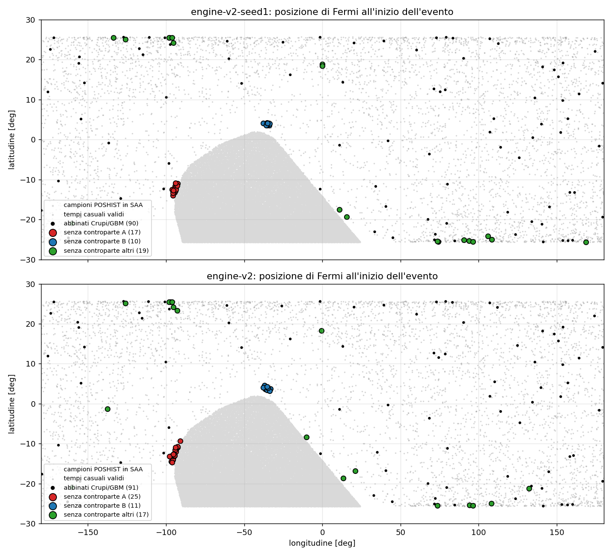
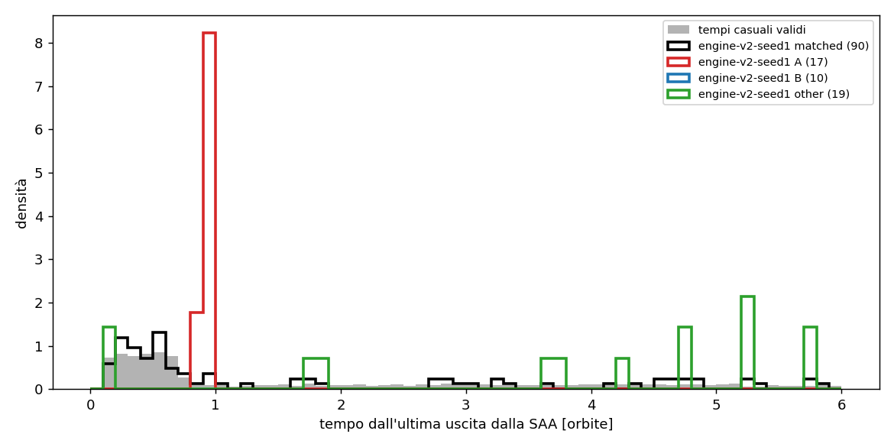

# Analisi orbitale degli eventi della baseline 2019

Generato da `python -m benchmark.analysis.orbit_analysis` e `python -m benchmark.analysis.orbit_report` (commit `53e7df1`). Sola lettura sugli output del motore: nessuna run, bundle o parametro modificato. Tutti i numeri vengono dai file in `data/runs/2019-03-01_2019-06-30/engine-v2-seed1/analysis/`.

Run analizzate: `engine-v2` (rete `model_03-2019_07-2019_4.4_2026-09-21`) e `engine-v2-seed1` (rete `model_2019-03-01_2019-06-30_seed1`). Eventi: engine-v2 144 (53 senza controparte), engine-v2-seed1 136 (46 senza controparte). "Senza controparte" = né catalogo trigger GBM né tabelle di Crupi (regola primaria di `benchmark/validate.py`).

## 1. Definizione di `dist_saa_gap_s`

Calcolata in `benchmark/validate.py` (non modificata):

- i **buchi** sono gli intervalli tra due righe consecutive di `pred/frg.csv` distanti più di 500 s (`np.diff(met) > 500`); `frg.csv` contiene solo i bin fuori SAA e mantiene il `met` anche dei bin mascherati;
- per ogni buco si prendono **due bordi**: il `met` dell'ultimo bin prima del buco (inizio) e del primo bin dopo (fine). Sono i bordi del **buco nei dati**, non della maschera (che si estende 150 bin, ≈614 s, verso l'interno dei dati);
- il tempo dell'evento è l'**inizio con offset FOCuS** (`start_times_offset`, il change point);
- `dist_saa_gap_s` = minimo di |bordo − tempo| su tutti i bordi: distanza **non firmata** dal bordo più vicino, sia esso un inizio o una fine.

Ricalcolata qui con la stessa definizione: differenza massima con il CSV della validazione 1.8e-12 s. Le distanze firmate dal buco precedente e successivo sono nelle colonne `t_since_gap_end_s` e `t_to_gap_start_s`.

Gruppi degli eventi senza controparte (bande che contengono i due addensamenti di engine-v2-seed1 con margine): **A** = 5050–5300 s, **B** = 5750–5900 s, **altri** = il resto.

## 2. Sovrapposizione tra le due reti

Abbinamento uno-a-uno di intervalli [inizio, inizio + durata] estesi di ±2 bin (greedy per |Δinizio|): **126** coppie, **18** eventi solo in engine-v2, **10** solo in engine-v2-seed1 (Δinizio mediano delle coppie 0.0 s).

Righe: gruppo dell'evento in engine-v2; colonne: gruppo dell'evento abbinato in engine-v2-seed1 (`absent` = nessun abbinamento).

| engine-v2 \ engine-v2-seed1 | matched | A | B | other | absent |
|---|---|---|---|---|---|
| matched | 90 | 0 | 0 | 0 | 1 |
| A | 0 | 17 | 0 | 0 | 8 |
| B | 0 | 0 | 7 | 0 | 4 |
| other | 0 | 0 | 0 | 12 | 5 |

Eventi solo in engine-v2-seed1 per gruppo: matched 0, A 0, B 3, other 7.

Risposta: gli eventi senza controparte **sono in gran parte gli stessi** nelle due reti. Tutti i 17 A di engine-v2-seed1 hanno un A in engine-v2; B: 7/10; altri: 12/19. Nessun evento cambia categoria tra abbinato e senza controparte. La rete legacy ne produce di più in A (25 contro 17).

## 3. Posizione orbitale

Metodo (per **tutti** gli eventi di entrambe le run e per 5000 istanti casuali presi tra i bin validi di engine-v2, ipotesi nulla):

- latitudine, longitudine: POSHIST (1 Hz, campione più vicino); altitudine e **L di McIlwain**: `gbm.data.PosHist` (gbm-data-tools);
- latitudine geomagnetica: **dipolo centrato semplice** (polo IGRF-13 2020: 80.65°N, -72.68°E), approssimazione;
- fase orbitale: argomento di latitudine (0° = nodo ascendente) da posizione e velocità ECI;
- SAA: intervalli dal bit SAA dei `FLAGS` di POSHIST (1090 passaggi nel periodo); periodo orbitale P = 5710 s (mediana tra nodi ascendenti);
- distanze firmate: tempo dall'ultima **uscita** e alla prossima **entrata** nella SAA; posizione di t − P rispetto al passaggio SAA dell'orbita precedente (0 = dentro la SAA; negativo = prima dell'entrata; positivo = dopo l'uscita); tempo dalla fine del buco dati precedente e all'inizio del successivo;
- distanza geografica dalla regione SAA: grande cerchio fino al più vicino campione POSHIST con flag SAA.

### Mediane per gruppo (engine-v2-seed1)

| gruppo | lat | lon | L | geomag_lat_dipole | phase_deg | t_since_saa_exit_s | t_to_saa_entry_s | prev_orbit_saa_offset_s | dist_saa_region_deg | alt_km |
|---|---|---|---|---|---|---|---|---|---|---|
| abbinati (90) | 4.5 | 68.1 | 1.2 | 0.9 | 154.7 | 4087.4 | 3840.1 | -820.8 | 64.5 | 532.9 |
| A (17) | -12.2 | -94.1 | 1.1 | -3.5 | 330.6 | 5164.6 | 51.4 | 0.0 | 1.2 | 535.7 |
| B (10) | 3.9 | -35.4 | 1.1 | 11.3 | 170.9 | 36877.3 | 5818.1 | -11528.1 | 2.7 | 534.5 |
| altri (19) | -19.3 | 10.9 | 1.6 | -18.8 | 229.9 | 28465.2 | 7048.9 | -9833.9 | 44.8 | 534.8 |
| nulla (5000) | 7.8 | 42.1 | 1.2 | 5.1 | 146.5 | 5621.5 | 5909.0 | -359.4 | 59.2 | 531.6 |

### Vicinanza alla SAA (conteggi)

| run | group | n | t−P dentro SAA | t−P entro 300 s da SAA | entrata SAA entro 1 orbita |
|---|---|---|---|---|---|
| cmp | matched | 91 | 2 | 4 | 52 |
| cmp | A | 25 | 25 | 25 | 24 |
| cmp | B | 11 | 0 | 0 | 2 |
| cmp | other | 17 | 0 | 0 | 6 |
| ref | matched | 90 | 2 | 4 | 51 |
| ref | A | 17 | 17 | 17 | 17 |
| ref | B | 10 | 0 | 0 | 1 |
| ref | other | 19 | 0 | 0 | 8 |
| null | null | 5000 | 56 | 145 | 2485 |

### Test KS a due campioni (engine-v2-seed1; p-value contro abbinati e contro tempi casuali)

Tutti i test (entrambe le run, tutte le variabili) sono in `data/runs/2019-03-01_2019-06-30/engine-v2-seed1/analysis/ks_tests.csv`. Campioni piccoli (A 17, B 10): i p-value indicano differenze di distribuzione, non la causa.

| group | variable | matched |
|---|---|---|
| A | L | 8.6e-06 |
| A | dist_saa_region_deg | 1.6e-18 |
| A | lat | 3.2e-06 |
| A | lon | 2.2e-07 |
| A | phase_deg | 3.0e-14 |
| A | prev_orbit_saa_offset_s | 5.2e-05 |
| A | t_to_saa_entry_s | 8.6e-20 |
| B | L | 8.3e-04 |
| B | dist_saa_region_deg | 1.3e-12 |
| B | lat | 1.5e-02 |
| B | lon | 2.3e-04 |
| B | phase_deg | 7.3e-03 |
| B | prev_orbit_saa_offset_s | 7.5e-06 |
| B | t_to_saa_entry_s | 2.8e-02 |
| other | L | 5.1e-06 |
| other | dist_saa_region_deg | 2.0e-02 |
| other | lat | 4.5e-02 |
| other | lon | 1.4e-01 |
| other | phase_deg | 3.0e-01 |
| other | prev_orbit_saa_offset_s | 6.8e-03 |
| other | t_to_saa_entry_s | 5.6e-03 |

### Il fondo previsto è sottostimato vicino alla SAA? (tutti i bin validi, non solo gli eventi)

Residuo relativo della somma dei 12 NaI in r1, (frg − bkg)/bkg, e frazione di bin con FOCuS r1 > 3σ su almeno un rivelatore. "Passaggio breve" = passaggio SAA più corto di 500 s (46 nel periodo, durata 18–495 s, mediana 328 s): il suo buco nei dati resta sotto la soglia di 500 s e **non viene mascherato**.

| run | zone | valid_bins | median_rel_residual_% | p90_rel_residual_% | frac_bins_focus_r1_gt3_% |
|---|---|---|---|---|---|
| cmp | 200 s before short passage | 2186 | 0.89 | 5.61 | 8.51 |
| cmp | 200 s after short passage | 2198 | -0.13 | 0.93 | 0.32 |
| cmp | within 3.5 deg of SAA region | 13136 | 0.45 | 2.51 | 2.08 |
| cmp | elsewhere | 1910078 | 0.13 | 1.00 | 0.16 |
| ref | 200 s before short passage | 2186 | 0.54 | 4.49 | 5.40 |
| ref | 200 s after short passage | 2198 | -0.14 | 0.83 | 0.27 |
| ref | within 3.5 deg of SAA region | 13136 | 0.22 | 2.04 | 1.63 |
| ref | elsewhere | 1910078 | 0.04 | 0.89 | 0.16 |

## 4. Verdetto

### Gruppo A — ipotesi "periferia SAA": **sostenuta**, con un meccanismo preciso

- Posizione: tutti i 17 eventi A di engine-v2-seed1 sono a lat -14.0–-10.9°, lon -96.1–-92.6°, sul **bordo occidentale** della regione SAA (a lat −12° la regione con flag va da lon -93.2° a -2.9°), fase 326–334°, a 0.6–2.4° dalla regione SAA (abbinati: mediana 65°; tempi casuali entro 3.5°: 0.78%).
- Tempo: iniziano 22–133 s **prima di entrare** nella SAA; 17/17 precedono di al più 200 s un **passaggio breve** (< 500 s) il cui buco dati non è mascherato. Un'orbita prima Fermi era dentro la SAA in 17/17 casi (tempi casuali: 56/5000).
- Il raggruppamento di `dist_saa_gap_s` a ≈ 5100–5200 s viene dalla definizione: il passaggio breve subito dopo l'evento non produce un buco > 500 s, quindi il bordo più vicino è la fine del buco lungo dell'**orbita precedente**. Per gli A, t − P cade 492–619 s prima di quella fine (P = 5710 s), cioè dentro il passaggio SAA precedente.
- Fondo: nei 200 s prima dei passaggi brevi il residuo relativo al 90° percentile è 4.5% (altrove 0.9%) e FOCuS supera 3σ nel 5.4% dei bin (altrove 0.16%); dopo l'uscita nessun eccesso (0.27%). La rete sottostima il fondo nell'avvicinamento ai passaggi brevi.
- Riproducibilità: stesso comportamento con la rete legacy (engine-v2: 24 eventi A prima di un passaggio breve; 8.5% dei bin sopra 3σ in quella zona).
- Probabilità che 17 dei 46 eventi senza controparte cadano nella banda A per caso (frazione dei tempi casuali nella banda: 0.64%): binomiale p = 7.4e-26.

### Gruppo B — ipotesi "periferia SAA nell'orbita successiva a un passaggio": **non sostenuta nella forma proposta**; periferia SAA **sostenuta**, ma nell'orbita *precedente* al primo passaggio

- Posizione: lat 3.5–4.2°, lon -37.7–-33.6°, fase 170–172°, a 2.4–3.1° dalla regione SAA: appena **a nord del bordo settentrionale** (regione con flag: lat da -25.7° a 1.9°, lon da -94.5° a 24.1°), una zona diversa da A.
- Tempo: un'orbita prima Fermi **non** era nella SAA (0/10); dall'ultima uscita sono passate 10.2 h (mediana). La prossima entrata arriva dopo 5818 s (mediana; 9/10 tra 5808 e 5832 s), cioè circa un'orbita dopo: B cade nell'orbita **che precede il primo passaggio** di una sequenza giornaliera, quando la traccia sfiora il bordo SAA senza entrarci.
- Fondo: entro 3.5° dalla regione SAA FOCuS supera 3σ nel 1.6% dei bin (altrove 0.16%), residuo al 90° percentile 2.0%.
- Probabilità della banda B per caso (0.48% dei tempi casuali): binomiale p = 2.3e-14. Con 10 eventi, la conclusione sulla posizione è solida; quella sul meccanismo (perché proprio lì) resta un'ipotesi.

Eventi abbinati a Crupi/GBM nelle stesse bande: A 2, B 0 su 90.

### Possibile flag di post-processing (descrizione, non implementata)

Un flag sull'**evento** (non un taglio sui trigger, nessuna modifica al motore), calcolato dopo `events_table.csv` dalla POSHIST:
- `saa_edge_short_passage`: l'inizio dell'evento è entro 200 s prima (o dopo) un passaggio SAA più breve di 500 s (buco non mascherato);
- `saa_region_proximity`: la posizione di Fermi all'inizio dell'evento è entro 3.5° dalla regione con flag SAA.
Gli eventi flaggati restano nel catalogo, con la segnalazione "possibile fondo di particelle al bordo SAA". Sui dati di engine-v2-seed1 il primo flag coprirebbe 17 eventi A; il secondo i B (distanza ≤ 3.1°). Soglie e conteggi andrebbero verificati anche sugli eventi abbinati prima di usarli.

## 5. Gli eventi "altri" senza controparte (engine-v2-seed1)

19 eventi; voci del catalogo trigger GBM entro ±1 h dall'inizio (con Δt firmato).

| trig_ids | start_times | duration | detectors | sigma_C | CE | lat | lon | L | phase_deg | t_since_saa_exit_s | t_to_saa_entry_s | dist_saa_gap_s | pair_group | gbm_within_1h |
|---|---|---|---|---|---|---|---|---|---|---|---|---|---|---|
| 0 | 2019-03-01 06:28:02 | 4.1 | n7 n9 nb | 14.0 | R | -25.1 | 90.7 | 1.6 | 258.2 |  | 10324.5 | 15854.9 | absent | - |
| 6 | 2019-03-07 01:51:23 | 41.0 | n0 n1 n2 n3 n4 n5 n6 n7 n8 n9 na nb | 880.9 | R | -24.1 | 106.0 | 1.5 | 250.7 | 21050.2 | 15973.8 | 15971.3 | absent | - |
| 8 | 2019-03-08 22:19:41 | 4.6 | n3 | 3.1 | P | -25.6 | 168.6 | 1.5 | 272.6 | 10052.1 | 26984.9 | 10050.7 | absent | GRB190308923 (GRB, -595 s) |
| 9 | 2019-03-09 04:40:38 | 28.7 | n0 n1 n2 n3 n4 n5 n6 n7 n8 n9 na nb | 39.2 | R | -25.5 | 74.1 | 1.6 | 275.2 | 32913.1 | 4123.9 | 4120.6 | absent | - |
| 13 | 2019-03-12 03:50:38 | 57.3 | n0 n1 n2 n3 n4 n5 n6 n7 n8 na nb | 63.0 | R | -19.3 | 15.6 | 1.4 | 229.9 | 37810.9 | 4887.1 | 4882.5 | other | - |
| 36 | 2019-04-05 13:32:42 | 114.7 | n2 n3 n4 n5 n7 n8 na nb | 23.7 | R | 25.5 | -97.9 | 1.6 | 90.3 | 29974.0 | 7059.0 | 7057.5 | other | - |
| 38 | 2019-04-06 13:19:56 | 139.3 | n0 n1 n2 n3 n5 n6 n7 n8 n9 na nb | 31.9 | R | 25.5 | -98.2 | 1.6 | 94.2 | 30090.9 | 7003.1 | 7000.2 | other | - |
| 45 | 2019-04-09 10:15:12 | 94.2 | n0 n1 n2 n6 n9 na nb | 33.5 | R | -25.4 | 93.8 | 1.6 | 263.1 | 26953.8 | 10065.2 | 10059.9 | other | - |
| 46 | 2019-04-10 08:26:24 | 4.1 | n1 n9 na nb | 31.6 | R | -25.0 | 108.4 | 1.6 | 257.9 | 21198.8 | 15808.2 | 15802.6 | other | - |
| 49 | 2019-04-12 00:39:53 | 4.1 | n2 | 3.2 | P | 18.9 | 0.0 | 1.1 | 48.5 | 695.6 | 4437.4 | 692.2 | absent | - |
| 59 | 2019-04-22 18:58:31 | 4.1 | n0 n2 n9 na | 7.0 | R | 18.4 | 0.0 | 1.1 | 46.8 | 680.6 | 4412.0 | 679.9 | other | - |
| 62 | 2019-04-25 04:51:44 | 12.3 | n2 n3 n4 n5 n6 n7 n8 na nb | 60.3 | R | -17.5 | 10.9 | 1.4 | 223.9 | 37707.2 | 4982.8 | 4980.8 | absent | - |
| 83 | 2019-05-14 11:57:51 | 69.6 | n0 n1 n2 n3 n4 n5 n6 n7 n8 n9 na nb | 96.5 | R | -20.9 | -160.2 | 1.2 | 303.9 | 10549.8 | 26486.2 | 10547.4 | other | - |
| 91 | 2019-05-19 14:34:51 | 36.9 | n2 n4 n5 n6 n7 n8 na nb | 14.9 | R | 25.5 | -96.2 | 1.7 | 90.6 | 29966.1 | 7048.9 | 7045.2 | other | - |
| 93 | 2019-05-20 12:41:05 | 49.2 | n4 n7 n8 na nb | 12.8 | R | 24.2 | -95.2 | 1.6 | 72.2 | 24011.4 | 13043.6 | 13037.6 | other | - |
| 96 | 2019-05-22 15:28:38 | 4.1 | na | 3.0 | P | 25.5 | -133.7 | 1.4 | 90.4 | 41295.2 | 1382.8 | 1380.4 | absent | - |
| 100 | 2019-05-29 09:57:11 | 12.3 | n9 na nb | 40.4 | R | -25.5 | 73.7 | 1.6 | 267.2 | 32725.3 | 4295.7 | 4292.7 | other | - |
| 101 | 2019-05-29 10:42:51 | 274.4 | n0 n1 n3 n4 n5 n6 n7 n9 na nb | 85.0 | R | 25.1 | -126.0 | 1.4 | 80.0 | 35465.6 | 1555.4 | 1552.4 | other | - |
| 116 | 2019-06-09 02:40:06 | 4.1 | n6 n7 n8 n9 nb | 41.2 | R | -25.5 | 96.3 | 1.6 | 264.2 | 26964.3 | 10094.7 | 10092.8 | other | - |

`pair_group` = gruppo dell'evento abbinato in engine-v2 (`absent` = presente solo in engine-v2-seed1). Mediane rispetto agli abbinati: L 1.58 contro 1.18, distanza dalla regione SAA 45° contro 65°.

Osservazioni (descrittive, nessun verdetto):

- **Alta L.** 15/19 "altri" hanno L ≥ 1.4 (abbinati: 20/90; tempi casuali: 16.8%). Si concentrano vicino ai punti di massima latitudine dell'orbita (|lat| ≥ 24°: 14/19), cioè alle latitudini geomagnetiche più alte raggiunte da Fermi: zona compatibile con precipitazione di particelle, ma qui non verificata.
- **Fondo previsto nullo.** Nella run engine-v2-seed1 la rete prevede fondo 0 in 212 celle (6 bin, due tratti di 3 bin consecutivi); nella engine-v2 in 0. Bin a zero **dentro** la finestra di S: eventi [6]; finestra di S che inizia o finisce **a un bin** da quei bin: eventi [9]. In engine engine-v2 `models/analyze.py::event_significance` non scartava B ≤ 0 (FOCuS sì) e l'evento con i bin a zero nella finestra aveva una significatività esplosa; la correzione è nel motore v3 (vedi `docs/WORKLOG.md`). Gli eventi adiacenti ai bin a zero non cambiano S, ma il loro trigger parte subito dopo il reset di FOCuS su quei bin ed esistono solo nella rete engine-v2-seed1: probabili artefatti della rete, non verificati.

## 5b. Bin con fondo previsto nullo nella rete engine-v2-seed1

Generato da `python -m benchmark.analysis.zero_prediction` (sola lettura: dataset ricostruito con `ModelNN.prepare`, allineato riga per riga a `pred/`; bundle `model_2019-03-01_2019-06-30_seed1`).

- **Dove**: 6 bin, 212 celle, in due tratti consecutivi: 2019-03-07 01:51:27, 2019-03-07 01:51:31, 2019-03-07 01:51:35, 2019-03-09 04:40:26, 2019-03-09 04:40:30, 2019-03-09 04:40:34.
- **Ingressi**: nessun NaN (0 su 6 × 60), bin regolari (Δt dal precedente 4.096–4.096 s), nessun salto: la variazione massima rispetto al bin precedente è 1.36 volte il 99.9° percentile dei salti tipici (vicini: 1.30).
- **Cosa hanno di anomalo**: la velocità angolare. `w1`, `w2`, `w3` sono **insieme** nella coda della distribuzione del periodo (percentili 99.51–99.994; |z| fino a 5.20 rispetto allo scaler di training). Non sono fuori scala: |z| massimo nei bin a zero 5.20, nei bin vicini 5.05.
- **Perché la rete dà 0**: la pre-attivazione dello strato di uscita (ReLU) è negativa su tutti i canali nei bin a zero pieno (massimo -350; nei vicini il massimo è almeno 324), e l'attivazione media del penultimo strato è 9.1–18.8 contro 0.89–1.63 nei vicini: la rappresentazione interna esplode e la ReLU finale taglia a zero. Non è un clipping esplicito né un ingresso NaN o fuori scala.
- **Sensibilità**: sostituendo un solo ingresso con la media dei vicini, nei bin a zero pieno l'uscita torna positiva solo con `w1` o `w2` (tabella sotto); con tutti gli ingressi dei vicini l'uscita è positiva in ogni caso (sì). La rete engine-v2-seed1 ha una risposta molto ripida in questa regione rara dello spazio degli ingressi; la rete di engine-v2 sugli stessi bin prevede 4553–4569 (somma dei 12 NaI in r1), valori normali.
- **Bin adiacenti**: 2 bin vicini hanno una predizione engine-v2-seed1 inferiore all'80% di quella di engine-v2 (2019-03-07 01:51:23, 2019-03-09 04:40:38). Eventi di engine-v2-seed1 con il flag `near_zero_prediction`: 6, 9; sono probabili artefatti di questa instabilità.

| timestamp | dt_prev_s | n_nan_inputs | max_abs_z | feature_max_abs_z | max_jump_over_p999 | ref_channels_le0 | preact_max | penultimate_mean_abs | cmp_pred_sum_r1 | inputs_that_restore |
|---|---|---|---|---|---|---|---|---|---|---|
| 2019-03-07 01:51:27 | 4.10 | 0 | 5.20 | w2 | 1.34 | 36 | -443.43 | 10.32 | 4552.85 | w1, w2 |
| 2019-03-07 01:51:31 | 4.10 | 0 | 5.13 | w2 | 1.36 | 36 | -578.80 | 12.66 | 4553.60 | w1, w2 |
| 2019-03-07 01:51:35 | 4.10 | 0 | 4.83 | w2 | 1.32 | 32 | 180.34 | 2.26 | 4553.35 | 60 input |
| 2019-03-09 04:40:26 | 4.10 | 0 | 4.54 | w3 | 1.30 | 36 | -349.78 | 9.14 | 4568.63 | w1, w2 |
| 2019-03-09 04:40:30 | 4.10 | 0 | 4.83 | w3 | 1.36 | 36 | -876.23 | 18.82 | 4567.50 | w1, w2 |
| 2019-03-09 04:40:34 | 4.10 | 0 | 4.88 | w3 | 1.36 | 36 | -451.77 | 11.17 | 4565.75 | w1, w2 |

Flag di post-processing `near_zero_prediction` (evento esteso di 5 bin che tocca un bin con fondo previsto ≤ 0): `models/flags.py` (step 7 della pipeline), riportato nel `RESULTS.md` della run.

## 6. Limiti

- Le bande A/B sono state scelte guardando i dati di engine-v2-seed1: i p-value binomiali misurano quanto il raggruppamento è anomalo, non sono un test cieco.
- Latitudine geomagnetica da dipolo centrato (approssimazione); L di McIlwain dalle tabelle di gbm-data-tools.
- Il confronto dei residui usa la somma dei 12 NaI in r1; non distingue i singoli rivelatori.
- La regione SAA è quella del flag di POSHIST, che è la regione in cui i rivelatori sono spenti; la regione fisica di particelle intrappolate è più ampia.
